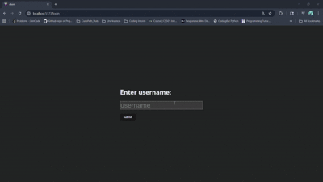

# Live Chat Web App

A real-time chat application built with React, Flask, Socket.IO, and MongoDB, allowing multiple users to chat simultaneously with persistent message storage.

## Demo



## Features

-   **Real-time Messaging:** Instant communication with low latency
-   **Multi-user Chat:** Chat with multiple users in the same room
-   **User Sessions:** Keep users logged in across visits
-   **Persistent Storage:** Chat history saved in MongoDB
-   **REST API:** Manage users, sessions, and messages

## Tech Stack

**Frontend:** React, TypeScript, CSS

**Backend:** Flask, Python, Socket.IO

**Database:** MongoDB

## Installation

1. Clone the repository:

```bash
  git clone [https://link-to-project](https://github.com/something0412/live_chat)
  cd live_chat
```

2. Backend Setup:

```bash
  cd server
  python -m venv venv
  source venv/bin/activate
  pip install -r requirements.txt
```

3. Start the server

```bash
  python server.py
```

4. Frontend Setup:

```bash
  cd client
  npm install
```

5. Start the client

```bash
  npm run dev
```

6. Open http://localhost:5173 to start chating

## Environment Variables

To run this project, you will need to add the following environment variables to your .env file

`SECRET_KEY=your_secret_key_here`

`MONGO_URI=your_mongodb_connection_string_here`

## Project Structure

```bash
live_chat/
  ├─ client/                  # React frontend
  │   └─ src/
  │       ├─ components/      # UI components
  │       ├─ pages/           # Page components
  │       ├─ App.tsx          # Main React component
  │       └─ main.tsx         # App entry point
  └─ server/                  # Flask backend
      ├─ server.py            # Main server file
      └─ requirements.txt     # Python dependencies
```

## License

[MIT License](https://github.com/something0412/live_chat/blob/main/LICENSE)
